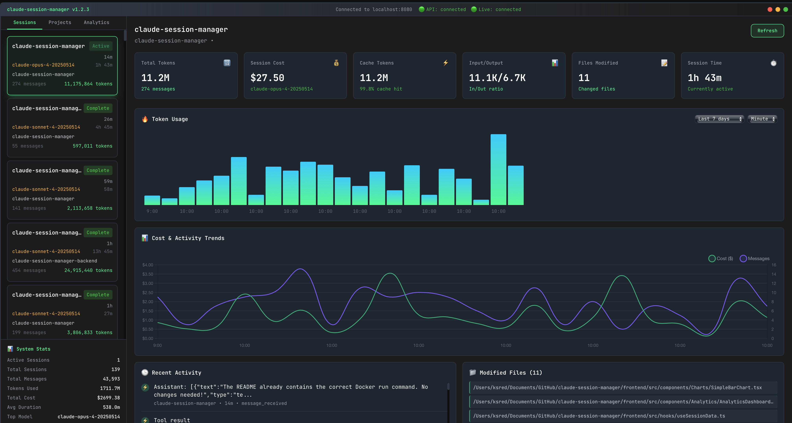

# Claude Session Manager

A beautiful web-based dashboard for monitoring and managing Claude Code sessions in real-time.



## Overview

Claude Session Manager provides a modern web interface to monitor all your active Claude Code sessions, track token usage, and manage multiple projects simultaneously. It reads session data directly from Claude's local file system and presents it through an intuitive web dashboard accessible from any browser.

## Features

- 🌐 **Web-Based Dashboard**: Access from any browser on your network
- 📊 **Real-time Monitoring**: Live updates via WebSocket connections
- 📈 **Interactive Charts**: Beautiful visualizations for token usage and costs
- 🎯 **Multi-Project Support**: Manage sessions across different projects and git worktrees
- 💰 **Cost Tracking**: Monitor token usage and estimated costs
- 🎨 **Modern UI**: Responsive design with dark/light themes
- ⚡ **High Performance**: Built with Go backend and React frontend
- 📱 **Mobile Friendly**: Fully responsive for desktop and mobile viewing
- 🐳 **Docker Support**: Easy deployment with Docker container

## Requirements

- Claude Code installed with sessions in `~/.claude/`
- Docker (for containerized deployment) OR
- Go 1.21+ and Node.js 18+ (for manual installation)

## Quick Start

### Using Docker (Recommended)

```bash
# Run with Docker - mounts your Claude directory as read-only
docker run -d -p 80:80 -v ~/.claude:/root/.claude:ro ksred/claude-session-manager

# Access the dashboard
open http://localhost
```

### Using Docker Compose

```bash
# Clone the repository
git clone https://github.com/ksred/claude-session-manager.git
cd claude-session-manager

# Start with Docker Compose
docker-compose up -d

# Open in browser
open http://localhost:8080
```

### Manual Installation

```bash
# Clone the repository
git clone https://github.com/ksred/claude-session-manager.git
cd claude-session-manager

# Backend setup
cd backend
go mod download
go build -o claude-session-manager ./cmd/main.go

# Frontend setup
cd ../frontend
npm install
npm run build

# Run the backend server
cd ../backend
./claude-session-manager serve
```

## Architecture

### Technology Stack

**Backend**:
- **Language**: Go (high-performance server)
- **Web Framework**: Gin
- **Database**: SQLite for caching and persistence
- **WebSocket**: Gorilla WebSocket for real-time updates
- **Data Source**: Claude Code filesystem (`~/.claude/`)
- **API Documentation**: Swagger/OpenAPI with swaggo

**Frontend**:
- **Framework**: React with TypeScript
- **Build Tool**: Vite
- **Styling**: Tailwind CSS
- **Charts**: Chart.js/Recharts
- **State Management**: Zustand
- **Real-time**: WebSocket integration

## Project Structure

```
claude-session-manager/
├── backend/                   # Go backend server
│   ├── cmd/                  # Application entry points
│   │   └── main.go          
│   ├── internal/            
│   │   ├── api/             # HTTP/WebSocket handlers
│   │   ├── claude/          # Claude session parsing
│   │   └── config/          # Configuration management
│   ├── pkg/                 # Shared packages
│   ├── Dockerfile           
│   └── go.mod              
├── frontend/                  # React frontend
│   ├── src/                
│   │   ├── components/      # React components
│   │   ├── hooks/           # Custom React hooks
│   │   ├── services/        # API services
│   │   ├── store/           # State management
│   │   ├── styles/          # Global styles
│   │   └── App.tsx         
│   ├── public/             
│   ├── Dockerfile          
│   ├── package.json        
│   └── vite.config.ts      
├── docker-compose.yml         # Docker orchestration
└── README.md                  # This file
```

## Configuration

The application can be configured through environment variables or a YAML configuration file.

### Environment Variables

```bash
# Server configuration
PORT=8080
HOST=0.0.0.0

# Claude directory (defaults to ~/.claude)
CLAUDE_HOME_DIR=~/.claude

# Database location
DB_PATH=./claude_sessions.db
```

### Configuration File

Create a configuration file at `configs/default.yaml`:

```yaml
server:
  host: "0.0.0.0"
  port: 8080
  cors_origins:
    - "http://localhost:3000"
    - "http://localhost:5173"

claude:
  home_dir: "~/.claude"
  watch_interval: 2s
  db_path: "./claude_sessions.db"

pricing:
  models:
    claude-3-opus-20240229:
      input_cost_per_1k: 0.015
      output_cost_per_1k: 0.075
    claude-3-5-sonnet-20241022:
      input_cost_per_1k: 0.003
      output_cost_per_1k: 0.015
```

## Development

### Backend Development

```bash
cd backend
go mod download
go run ./cmd/main.go serve --dev
```

### Frontend Development

```bash
cd frontend
npm install
npm run dev
```

### Running Tests

```bash
# Backend tests
cd backend
go test ./...

# Frontend tests
cd frontend
npm test
```

## API Documentation

The backend provides a comprehensive RESTful API with Swagger documentation:

### Accessing API Documentation

When the server is running, access the interactive Swagger UI at:
```
http://localhost:8080/docs/
```

### Main Endpoints

**Sessions**
- `GET /api/v1/sessions` - List all sessions
- `GET /api/v1/sessions/{id}` - Get session by ID
- `GET /api/v1/sessions/active` - Get active sessions
- `GET /api/v1/sessions/recent` - Get recent sessions with optional limit

**Analytics**
- `GET /api/v1/metrics/summary` - Get overall metrics summary
- `GET /api/v1/metrics/activity` - Get activity timeline
- `GET /api/v1/metrics/usage` - Get usage statistics

**Search & Files**
- `GET /api/v1/search` - Search sessions by query
- `GET /api/v1/recent-files` - Get recently accessed files

**Real-time Updates**
- `GET /api/v1/ws` - WebSocket endpoint for real-time session updates

**Health**
- `GET /api/v1/health` - Health check endpoint

## Browser Compatibility

- Chrome/Edge 90+
- Firefox 88+
- Safari 14+
- Mobile browsers (iOS Safari, Chrome Mobile)

## Contributing

Contributions are welcome! Please feel free to submit a Pull Request.

## Troubleshooting

### Common Issues

1. **Permission Denied**: Ensure the Docker container has read access to `~/.claude`
2. **Port Already in Use**: Change the port mapping in the docker run command
3. **No Sessions Showing**: Verify Claude Code sessions exist in `~/.claude/sessions/`

### Logs

View Docker container logs:
```bash
docker logs <container-id>
```

## License

MIT License - see LICENSE file for details

## Acknowledgments

Built for the Claude Code community to enhance session management and monitoring.